# CountryPicker

A country picker for Jetpack Compose (Material 3). Drop in one composable and get a searchable list of
248 countries with flags, dial codes and localized names, as a full-screen page or a bottom sheet, with
an optional detail step and an adaptive two-pane layout on wide screens.

| Fullscreen list | Bottom sheet | Detail pane |
|:---:|:---:|:---:|
| 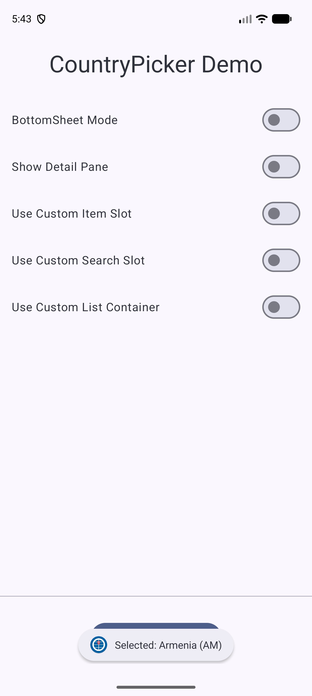 | 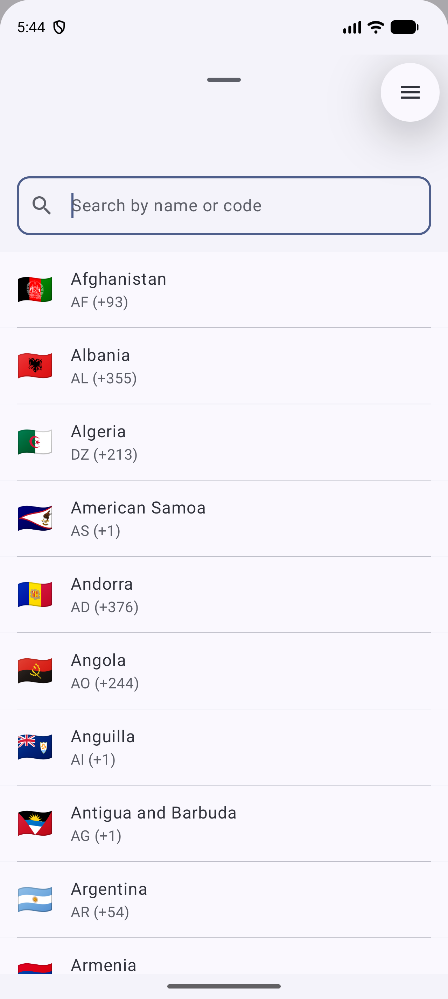 | 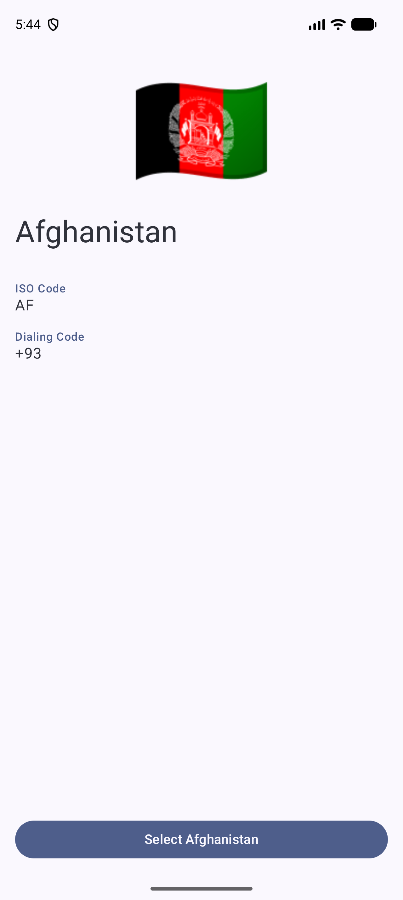 |

## What's included

- **Searchable list** of 248 countries: flag emoji, ISO code and dial code on every row.
- **Localized names** in 9 languages (`en`, `fr`, `es`, `de`, `it`, `ja`, `pt`, `ru`, `zh`), and search matches
  any of them.
- **Two presentation modes**: `Fullscreen` and `BottomSheet`.
- **Optional detail pane** showing flag, name, ISO code and dialing code, with a "Select" button.
- **Adaptive layout**: on wide screens (tablets, landscape) the list and detail panes sit side by side.
- **Customizable UI** through three slots: list item, search bar and list container.
- **Data layer you can use on its own**: `CountryRepository` loads and searches the bundled data without any UI.
- **+1 countries carry an `areaCode`** (for example American Samoa is `+1` / `684`).

### Search

Search is a case-insensitive "contains" match against any localized name, the ISO code, or the dial code.

| By localized name (`deutsch` finds Germany) | By dial code (`+91` finds India) |
|:---:|:---:|
| 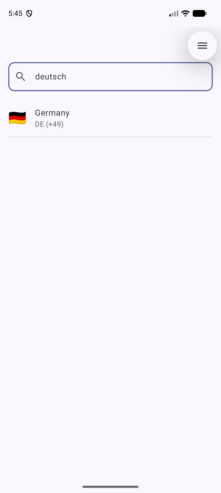 | 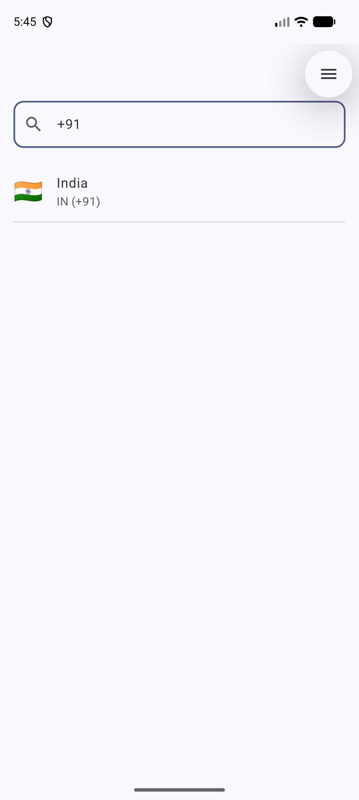 |

### Customization slots

| Custom item | Custom search | Custom list container |
|:---:|:---:|:---:|
| 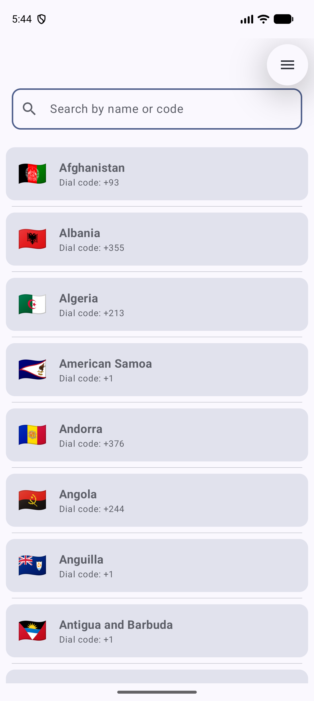 | 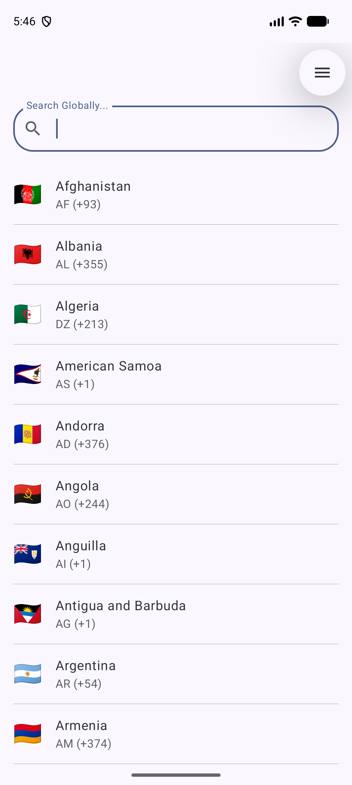 | 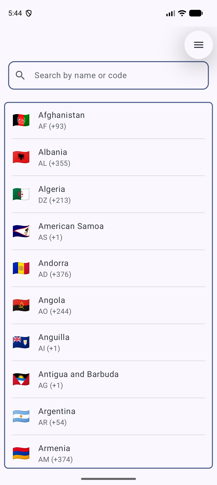 |

### Adaptive (landscape / tablet)

| Demo in landscape | List | List + detail side by side |
|:---:|:---:|:---:|
| 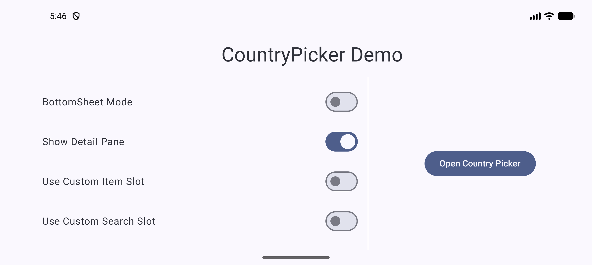 | 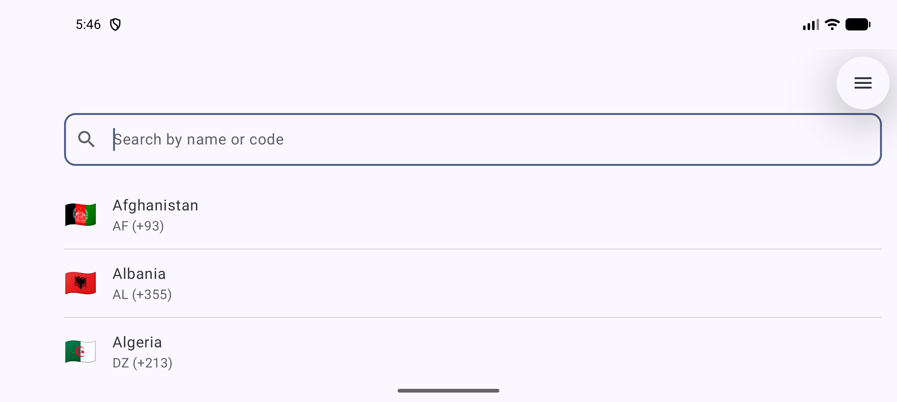 | 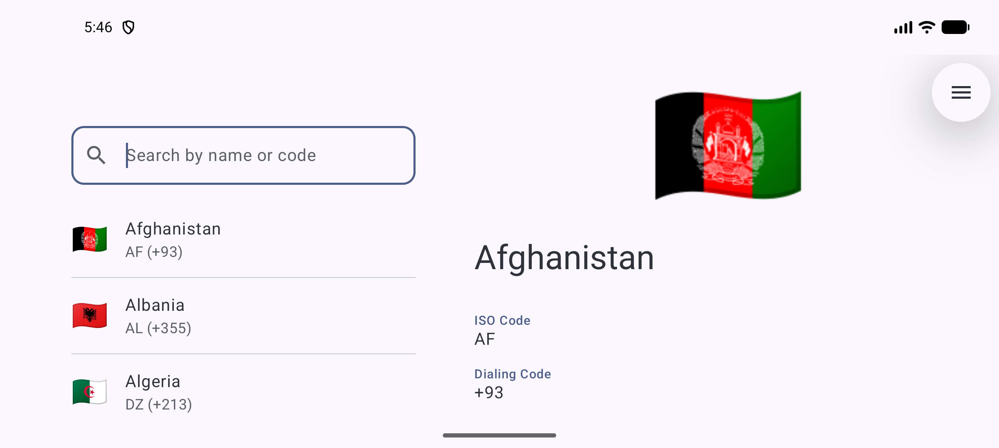 |

## Requirements

- `minSdk` 29, `compileSdk` 37
- A Compose app using Material 3. The picker uses your `MaterialTheme`, so it picks up your colors and typography.
  (The library also ships `CountryPickerTheme`, a ready-made theme used by the demo app.)

## Installation

### JitPack (recommended)

Add the JitPack repository, then the dependency.

```kotlin
// settings.gradle.kts
dependencyResolutionManagement {
    repositories {
        google()
        mavenCentral()
        maven { url = uri("https://jitpack.io") }
    }
}

// app/build.gradle.kts
dependencies {
    implementation("com.github.neeraj-chandrasekharan.CountryPicker:library:1.1.0")
}
```

Versions are the repository's release tags (for example `v1.1.0` is used as `1.1.0`).

### Other options

**As a module in the same project** (what the demo app does)

```kotlin
// app/build.gradle.kts
dependencies {
    implementation(project(":library"))
}
```

**From your local Maven repository**

```bash
./gradlew :library:publishToMavenLocal
```

Then add `mavenLocal()` to your repositories and depend on `com.njtech.countrypicker:library:1.1.0`.

## Quick start

```kotlin
import com.njtech.countrypicker.ui.widget.CountryPicker

@Composable
fun PickCountryScreen() {
    CountryPicker(
        onCountrySelected = { country ->
            // country.name["en"], country.code, country.dialCode, country.flag ...
        }
    )
}
```

That's a full-screen, searchable picker. Everything else is optional.

## Ways to use it

### 1. Full-screen picker

Best as its own screen or navigation destination. In `Fullscreen` mode the picker does not dismiss itself,
so you decide what happens after a selection (pop the back stack, hide it, and so on).

```kotlin
var showPicker by rememberSaveable { mutableStateOf(false) }

BackHandler(showPicker) { showPicker = false }

if (showPicker) {
    CountryPicker(
        mode = CountryPickerMode.Fullscreen,   // default
        onCountrySelected = { country ->
            selected = country
            showPicker = false
        }
    )
}
```

### 2. Bottom sheet from a form field

The typical "phone number with country code" case. Show the sheet while a flag is true, and clear the flag in
both callbacks.

```kotlin
var showSheet by rememberSaveable { mutableStateOf(false) }
var selected by remember { mutableStateOf<Country?>(null) }

OutlinedButton(onClick = { showSheet = true }) {
    Text(selected?.let { "${it.flag} ${it.dialCode}" } ?: "Select country")
}

if (showSheet) {
    CountryPicker(
        mode = CountryPickerMode.BottomSheet,
        onCountrySelected = {
            selected = it
            showSheet = false
        },
        onDismiss = { showSheet = false }      // swipe down / tap outside
    )
}
```

### 3. With a detail step

Set `showDetailPane = true` and tapping a row opens a detail view with a "Select" button instead of selecting
immediately. On a phone the detail replaces the list; on a wide screen it appears next to it. This works in both
modes. Use it when you want users to confirm, or to show more than name and code.

```kotlin
CountryPicker(
    showDetailPane = true,
    onCountrySelected = { country -> /* fired from the detail screen's Select button */ }
)
```

### 4. Custom UI with slots

Replace any part of the list UI. Each slot is optional, and you can combine them.

```kotlin
CountryPicker(
    onCountrySelected = { /* ... */ },

    // one row
    itemContent = { country ->
        Card(Modifier.fillMaxWidth().padding(8.dp)) {
            Row(Modifier.padding(16.dp), verticalAlignment = Alignment.CenterVertically) {
                Text(country.flag, fontSize = 32.sp)
                Spacer(Modifier.padding(8.dp))
                Column {
                    Text(country.name["en"].orEmpty(), fontWeight = FontWeight.Bold)
                    Text("Dial code: ${country.dialCode}")
                }
            }
        }
    },

    // the search bar
    searchContent = { query, onQueryChange ->
        OutlinedTextField(
            value = query,
            onValueChange = onQueryChange,
            label = { Text("Search Globally...") },
            leadingIcon = { Icon(Icons.Default.Search, contentDescription = null) },
            modifier = Modifier.fillMaxWidth().padding(16.dp)
        )
    },

    // a wrapper around the whole list
    listContainer = { content ->
        Box(
            Modifier.fillMaxSize().padding(8.dp)
                .border(2.dp, MaterialTheme.colorScheme.primary, RoundedCornerShape(8.dp))
        ) { content() }
    }
)
```

`itemContent` rows are made clickable for you, so don't add your own click handler. Just draw the row.

### 5. Data only, with your own UI

If you only need the country data (a dropdown, a spinner, validation), skip the picker and use
`CountryRepository`. It reads the bundled JSON on `Dispatchers.IO` and returns a `Result`.

```kotlin
val repository = CountryRepository(context)

// all countries
repository.getCountries().onSuccess { countries -> /* List<Country> */ }

// same matching rules as the picker's search box, sorted by English name
repository.searchCountries("ind").onSuccess { matches -> /* ... */ }
```

For tests, or to supply your own data, pass JSON instead of a context:

```kotlin
val repository = CountryRepository(jsonString = myJson)
```

To reuse the same matching rule on your own list, call `country.matches(query)`.

### 6. Building blocks

The screens the picker is built from are public, so you can lay them out yourself. For example, embed the
list inside your own scaffold:

```kotlin
val viewModel: CountryViewModel = viewModel(
    factory = viewModelFactory { initializer { CountryViewModel(CountryRepository(context)) } }
)
val uiState by viewModel.uiState.collectAsState()

CountryListScreen(
    uiState = uiState,
    onSearchQueryChange = viewModel::onSearchQueryChange,
    onCountryClick = { country -> /* ... */ }
)
```

`CountryListScreen` also accepts the `itemContent`, `searchContent` and `listContainer` slots, and
`CountryDetailScreen(country, onSelectClick)` is available for the detail view.

## API reference

### `CountryPicker`

| Parameter | Type | Default | Description |
|---|---|---|---|
| `onCountrySelected` | `(Country) -> Unit` | required | Called when the user picks a country. |
| `modifier` | `Modifier` | `Modifier` | Applied to the root container. |
| `mode` | `CountryPickerMode` | `Fullscreen` | `Fullscreen` or `BottomSheet`. |
| `showDetailPane` | `Boolean` | `false` | Show a detail step (side by side on wide screens) before selecting. |
| `onDismiss` | `(() -> Unit)?` | `null` | Called when a bottom sheet is dismissed or closes after a selection. |
| `itemContent` | `@Composable (Country) -> Unit` | `null` | Custom list row. |
| `searchContent` | `@Composable (query, onQueryChange) -> Unit` | `null` | Custom search bar. |
| `listContainer` | `@Composable (content) -> Unit` | `null` | Wrapper around the list. |

### `Country`

| Field | Type | Example |
|---|---|---|
| `name` | `Map<String, String>` | `{"en": "Germany", "de": "Deutschland", ...}` |
| `code` | `String` | `"DE"` (ISO 3166-1 alpha-2) |
| `dialCode` | `String` | `"+49"` |
| `areaCode` | `String?` | `"684"` for American Samoa (`+1`), otherwise `null` |
| `flag` | `String` | `"🇩🇪"` (emoji) |

## Demo app

The `:app` module is a demo with a switch for each option above (bottom sheet, detail pane, and the three
custom slots) so you can try every combination. It also rotates cleanly between portrait and landscape.

```bash
./gradlew :app:installDebug
```

## Project layout

```
app/        demo app
library/    the CountryPicker library
  data/model/            Country
  data/repository/       CountryRepository
  ui/widget/             CountryPicker, CountryPickerMode
  ui/screens/            CountryListScreen, CountryDetailScreen
  ui/viewmodel/          CountryViewModel
  ui/theme/              CountryPickerTheme
  res/raw/countries.json bundled country data
docs/screenshots/        images used in this README
```

## Running the tests

```bash
./gradlew :library:testDebugUnitTest
```
